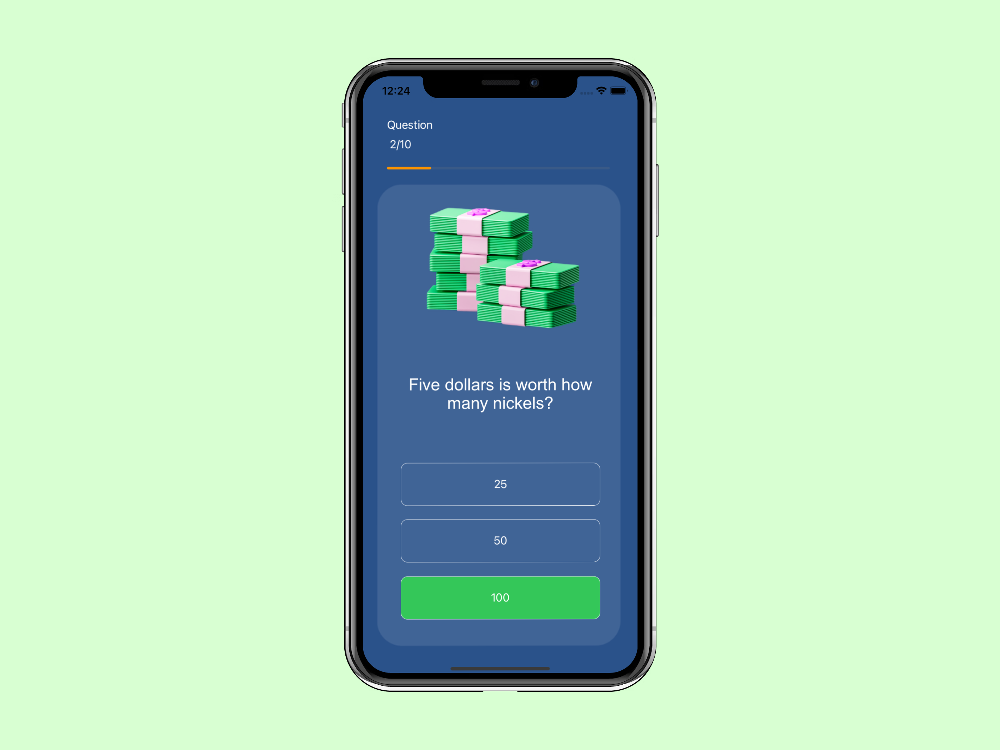
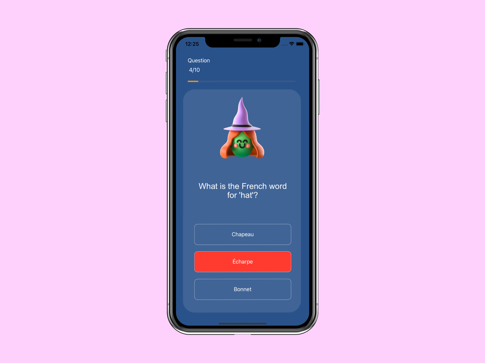
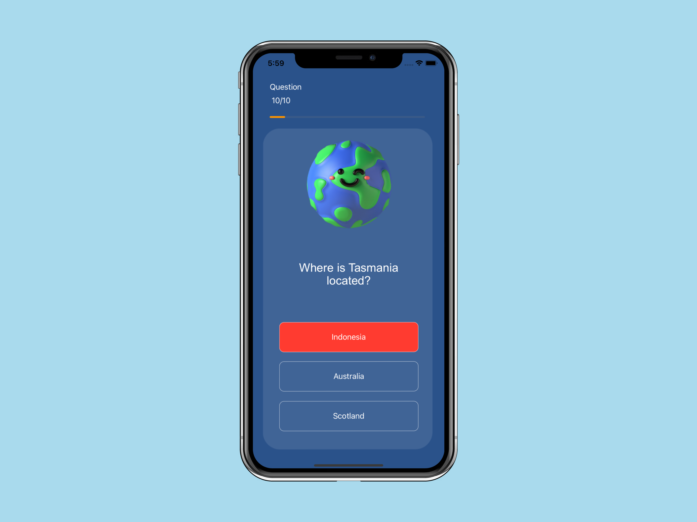

# QuizzlerWithSwift

**Description:**

Quizzler is a simple and fun question-answer application. With this app, you can test your knowledge by solving a quick 10-question quiz. You have only 10 seconds for each question. If a question goes unanswered or the time runs out, you will automatically move on to the next question.

**Features:**

Test your knowledge with quick and fun questions.
You have 10 seconds for each question.
Learn correct and incorrect answers by checking them.
Track how many questions you've answered with a progress indicator.

**Technologies Used:**
Developed using the Swift programming language and the Xcode development environment.
User interface designed using Storyboard.

